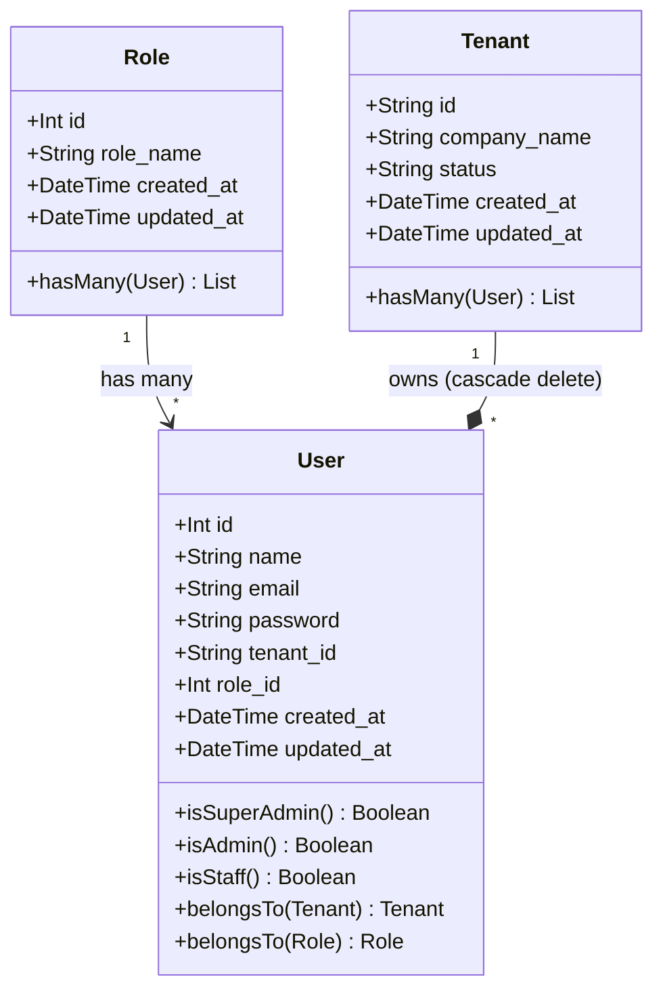
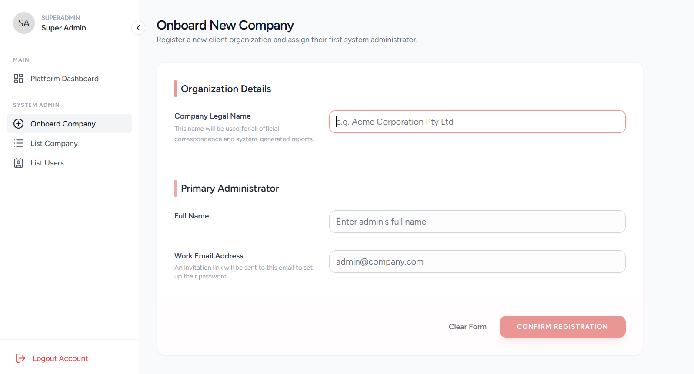
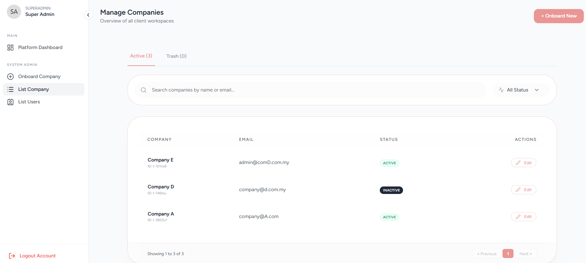
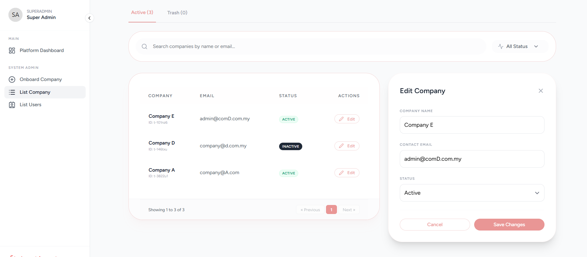

# 🏢 Multi-Tenant HR System
> A shared-database multi-tenancy HR platform built with Laravel, Inertia.js & Vue 3 — designed for payroll & HR management.


---

## 📌 Overview

This project implements a **shared-database multi-tenancy** system — meaning all companies (tenants) share a single database, isolated at the application layer using `tenant_id` scoping. It is designed for  HR & payroll use cases and intentionally does **not** use domain-based tenant resolution.

**Key Design Decisions:**
- ✅ Shared database (no per-tenant DB)
- ✅ No domain routing table (not needed for this architecture)
- ✅ `TenantScope` trait applied on all models to prevent cross-company data leakage
- ✅ Role-based access: `SuperAdmin`, `CompanyAdmin`, `Staff`
- ✅ SuperAdmin has `tenant_id = null` (global access)
---

## 📐 UML Class Diagram



> **Note:** `User.tenant_id` is `null` for SuperAdmin — they are not bound to any company.

---

## 🗂️ ERD (Entity Relationship Diagram)

```
┌──────────────┐       ┌──────────────┐       ┌──────────────┐
│   tenants    │       │    users     │       │    roles     │
├──────────────┤       ├──────────────┤       ├──────────────┤
│ id (varchar) │◄──────│ tenant_id    │  ┌───►│ id (int)     │
│ company_name │       │ id (int)     │  │    │ role_name    │
│ status       │       │ name         │  │    │ created_at   │
│ created_at   │       │ email        │  │    │ updated_at   │
│ updated_at   │       │ password     │  │    └──────────────┘
└──────────────┘       │ role_id ─────┼──┘
                       │ remember_token│
                       │ created_at   │
                       │ updated_at   │
                       └──────────────┘
```

> 📎 Full diagram: [View on dbdiagram.io](https://dbdiagram.io/d/saas-app-69a79c60a3f0aa31e1ba7347)

**Roles:**
Roles (Global Lookup Table):
| ID | Role Name | Description |
|:---|:---|:---|
| 1 | SuperAdmin | Full System Access (No Tenant Restriction) |
| 2 | CompanyAdmin | Management Access for a specific Tenant |
| 3 | Staff | Standard Access for a specific Tenant |

Users (The Actual Data):
| Name | role_id | tenant_id | Access Level |
|:---|:---|:---|:---|
| Hasya | 1 | null | Global (Sees Everything) |
| Admin A | 2 | t-xxxxx | Scoped (Sees Company E) |
| Staff B | 3 | t-xxxx | Scoped (Sees Company D) |

---

### 📸 System Walkthrough

<details>
  <summary><b>Click to view Super Admin Screenshots</b></summary>

  #### 1. Registration & Onboarding
  

  #### 2. Company Management
  

  #### 3. Edit Access
  

</details>


## ✨ Features

### 🏗️ Core Infrastructure (Done)
- Multi-tenant Architecture: Shared-database isolation using tenant_id and global scopes.
- Role-Based Access Control (RBAC): Custom middleware for SuperAdmin, CompanyAdmin, and Staff.
- Dynamic UI Components: Reusable Vue 3 components (StatusBadges, Modals, Pagination).
- Global Lookup System: Centralized database-driven management for statuses and categories.
- Side navigation menu

### 🏢 SuperAdmin Management (In Progress)
- [x] Tenant Registration: Onboarding flow for new companies
- [x] Tenant List:  data tables with filtering and tabbed views (Active/Trash).
- [x] Recovery System: Soft-deleting tenants with Restore/Force Delete functionality.

### 🏢 SuperAdmin Management (In Progress)
- [ ] User Management: Inviting and managing staff within a specific tenant.
- [ ] Attendance & Leave: Tracking clock-ins and time-off requests.
- [ ] Payroll: Monthly salary calculations and generation.


---

## 🚀 Getting Started

### Prerequisites
- PHP 8.2+
- Composer
- Node.js & NPM
- MySQL / MariaDB

### Installation

```bash
# Clone the repository
git clone https://github.com/your-username/your-repo.git
cd your-repo

# Install PHP dependencies
composer install

# Install JS dependencies
npm install

# Copy environment file
cp .env.example .env


# Configure your database in .env, then run:
php artisan migrate:fresh --seed

# Start development servers
php artisan serve
npm run dev
```

### Default SuperAdmin Credentials
> You may change these before you db seed, this is only 

```
Email:    superadmin@example.com
Password: password123
```

---

## 📁 Project Structure (Key Files)

```
app/
├── Http/
│   ├── Controllers/
│   │   ├── Auth/
│   │   │   └── AuthenticatedSessionController.php  ← Modified for SuperAdmin login
│   │   └── SuperAdminDashboardController.php
│   └── Middleware/
│       └── CheckSuperAdmin.php
├── Models/
│   ├── Tenant.php          
│   └── User.php            ← Uses HasTenant trait
├── Scopes/
│   └── TenantScope.php     ← Shared DB isolation logic
└── Traits/
    └── HasTenant.php       ← Applied to models

database/
├── migrations/
└── seeders/
    ├── DatabaseSeeder.php  ← Seeds SuperAdmin + roles
    └── RoleSeeder.php

resources/js/
├── Pages/
└── Layouts/
    └── (side menu)
```

---

## 🔧 Architecture Notes

### Why Shared Database?
Unlike domain-based tenancy (where each tenant gets their own DB or subdomain), this project uses **shared-database tenancy** — all tenant data lives in one database, scoped by `tenant_id`. This avoids the complexity of per-tenant databases while keeping data properly isolated.

### TenantScope — How It Works
Every model that belongs to a tenant uses the `HasTenant` trait, which automatically applies a `WHERE tenant_id = ?` constraint on all queries. This prevents Company A from ever seeing Company B's data.

```php
// Example: Automatically scoped
User::all(); // Only returns users belonging to the current tenant
```

SuperAdmin bypasses this scope entirely (since `tenant_id = null`).

---

## 📦 Key Packages

| Package | Purpose |
|---|---|
| `stancl/tenancy` | Multi-tenancy foundation |
| `inertiajs/inertia-laravel` | SPA-style routing |
| `vue` | Frontend framework |

---

## 👤 About

This is a **solo personal project** built for learning and portfolio purposes. It is not open for collaboration at this stage, but feel free to explore the code.

---

