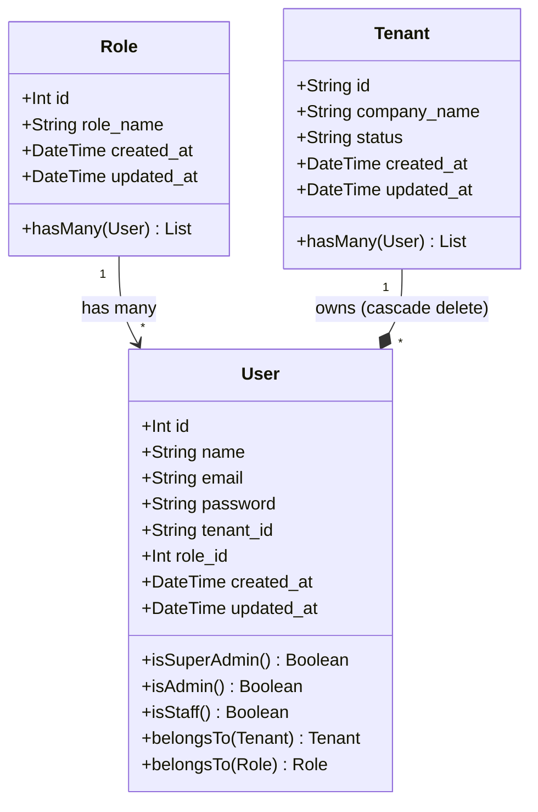

# 🏢 Multi-Tenant HR System
> A shared-database multi-tenancy HR platform built with Laravel, Inertia.js & Vue 3 — designed for  & HR management.


---
<!-- TODO:: visual demo , image and video here -->
<!--  -->
## 📌 Overview 

This project implements a **shared-database multi-tenancy** architecture where all companies (tenants) share a single database, completely isolated at the application layer via `tenant_id` scoping. Built specifically for HR management workflows, it intentionally bypasses complex domain-based routing in favor of streamlined, application-level security.


### 📸 System Walkthrough
> *Watch a quick walkthrough demonstrating the tenant recovery and hard-delete safety system:*  

[](https://youtu.be/LGWL96UL2Dk)


## ✨ Features

### 🏗️ Core Infrastructure (Done)
- Multi-tenant Architecture: Shared-database isolation using tenant_id and global scopes.
- Role-Based Access Control (RBAC): Custom middleware for SuperAdmin, CompanyAdmin, and Staff.
- Dynamic UI Components: Reusable Vue 3 components (StatusBadges, Modals, Pagination).
- Global Lookup System: Centralized database-driven management for statuses and categories.
- Side navigation menu

### 🏢 SuperAdmin Management (Done)
- [x] Tenant Registration: Onboarding flow for new companies
- [x] Tenant List:  data tables with filtering and tabbed views (Active/Trash).
- [x] Recovery System: Soft-deleting tenants with Restore/Force Delete functionality.

### 🏢 CompanyAdmin Management (In Progress)
- [x] Department Management: Add and update departments
- [x] Staff List: View users within tenant
- [x] Staff Creation: Onboarding new staff 
- [x] Staff Profile: View and edit staff details 
- [/] Leave Application (in progress)
- [ ] Claim OT/Mileage and so on
- [ ] Attendance

### 🏢 Staff
- [x] Login 
- [/] Apply Leave 
---

## 🚀 Getting Started

### Prerequisites
- PHP 8.2+
- Composer
- Node.js & NPM
- MySQL / MariaDB

### Installation

```bash
# Clone the repository
git clone https://github.com/hasya-manan/saas-app.git

cd your-repo

# Install PHP dependencies
composer install

# Install JS dependencies
npm install

# Copy environment file
cp .env.example .env


# Configure your database in .env, then run:
php artisan migrate:fresh --seed

# Start development servers
php artisan serve
npm run dev
```

### Default SuperAdmin Credentials
> You may change these in the seeder before running migrate:fresh --seed"

```
Email:    superadmin@example.com
Password: password123
```


## 📦 Key Packages

| Package | Purpose |
|---|---|
| `stancl/tenancy` | Multi-tenancy foundation |
| `inertiajs/inertia-laravel` | SPA-style routing |
| `vue` | Frontend framework |

---

## 👤 About

This is a **solo personal project** built for learning and portfolio purposes. It is not open for collaboration at this stage, but feel free to explore the code.

---

<details>
## 📐 UML Class Diagram


```mermaid
classDiagram
    class Tenant {
        +String id
        +String company_name
        +String status
        +DateTime created_at
        +DateTime updated_at
        +hasMany(User) List
    }

    class User {
        +Int id
        +String name
        +String email
        +String password
        +String tenant_id
        +Int role_id
        +DateTime created_at
        +DateTime updated_at
        +isSuperAdmin() Boolean
        +isAdmin() Boolean
        +isStaff() Boolean
        +belongsTo(Tenant) Tenant
        +belongsTo(Role) Role
    }

    class Role {
        +Int id
        +String role_name
        +DateTime created_at
        +DateTime updated_at
        +hasMany(User) List
    }

    Role "1" --> "*" User : has many
    Tenant "1" --* "*" User : owns (cascade delete)
```

> **Note:** `User.tenant_id` is `null` for SuperAdmin — they are not bound to any company.

---

## 🗂️ ERD (Entity Relationship Diagram)

```
┌──────────────┐       ┌──────────────┐       ┌──────────────┐
│   tenants    │       │    users     │       │    roles     │
├──────────────┤       ├──────────────┤       ├──────────────┤
│ id (varchar) │◄──────│ tenant_id    │  ┌───►│ id (int)     │
│ company_name │       │ id (int)     │  │    │ role_name    │
│ status       │       │ name         │  │    │ created_at   │
│ created_at   │       │ email        │  │    │ updated_at   │
│ updated_at   │       │ password     │  │    └──────────────┘
└──────────────┘       │ role_id ─────┼──┘
                       │ remember_token│
                       │ created_at   │
                       │ updated_at   │
                       └──────────────┘
```

<!-- > 📎 Full diagram: [View on dbdiagram.io](https://dbdiagram.io/d/saas-app-69a79c60a3f0aa31e1ba7347) -->

**Roles:**
Roles (Global Lookup Table):
| ID | Role Name | Description |
|:---|:---|:---|
| 1 | SuperAdmin | Full System Access (No Tenant Restriction) |
| 2 | CompanyAdmin | Management Access for a specific Tenant |
| 3 | Staff | Standard Access for a specific Tenant |

Users (The Actual Data):
| Name | role_id | tenant_id | Access Level |
|:---|:---|:---|:---|
| Hasya | 1 | null | Global (Sees Everything) |
| Admin A | 2 | t-xxxxx | Scoped (Sees Company E) |
| Staff B | 3 | t-xxxx | Scoped (Sees Company D) |

---
</details>
